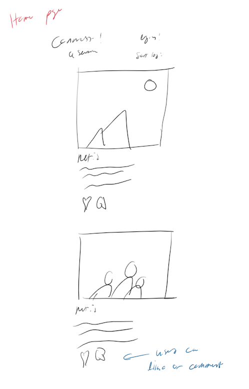
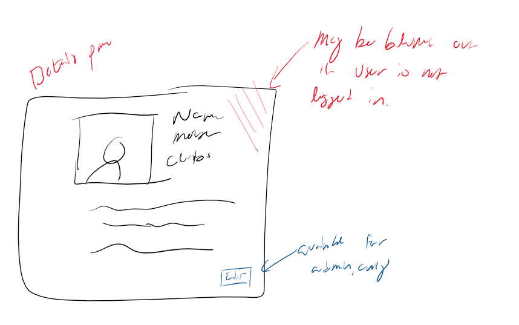
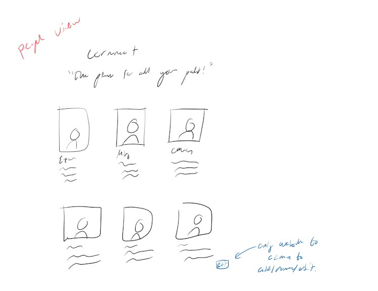
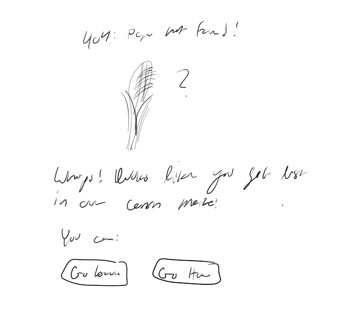

# Project 3: Design Journey

**For each milestone, complete only the sections that are labeled with that milestone.** Refine all sections before the final submission.

You are graded on your design process. If you later need to update your plan, **do not delete the original plan, rather leave it in place and append your new plan _below_ the original.** Then explain why you are changing your plan. Any time you update your plan, you're documenting your design process!

**Replace ALL _TODOs_ with your work.** (There should be no TODOs in the final submission.)

Be clear and concise in your writing. Bullets points are encouraged.

**Everything, including images, must be visible in _Markdown: Open Preview_.** If it's not visible in the Markdown preview, then we can't grade it. We also can't give you partial credit either. **Please make sure your design journey should is easy to read for the grader;** in Markdown preview the question _and_ answer should have a blank line between them.


## Design Plan (Milestone 1)

**Make the case for your decisions using concepts from class, as well as other design principles, theories, examples, and cases from outside of class (includes the design prerequisite for this course).**

You can use bullet points and lists, or full paragraphs, or a combo, whichever is appropriate. The writing should be solid draft quality.


### Catalog (Milestone 1)
> What will your catalog website be about? (1 sentence)

The catalog will be about Cornellians, similar to project 2, but with an expanded focus.

### _Consumer_ Audience (Milestone 1)
> Briefly explain your site's _consumer_ audience. Your audience should be specific, but not arbitrarily specific. (1 sentence)
> Justify why this audience is a **cohesive** group. (1-2 sentences)

The audience will be all Cornellians, but with a focus on the Cornellians who are interested in an exclusive social media platform to meet similar cornellians.

It is cohesive because it is specfically the Cornell student body.

### _Consumer_ Audience Goals (Milestone 1)
> Document your _consumer_ audience's goals for using this catalog website.
> List each goal below. There is no specific number of goals required for this, but you need enough to do the job (Hint: It's more than 1. But probably not more than 3.)
> **Hint:** Users will be able to view all entries in the catalog and insert new entries into the catalog. The audience's goals should probably relate to these activities.

Goal 1: View the database

- **Design Ideas and Choices** _How will you meet those goals in your design?_
  - The home page will recent posts by users
  - It will not require a login
- **Rationale & Additional Notes** _Justify your decisions; additional notes._
  - This allows visitors to see the site, and choose if they want to add themselves to the database

Goal 2: View the user database

- **Design Ideas and Choices** _How will you meet those goals in your design?_
  - The database can be searched by users
  - Consumers can select only certain indviuals to view, by year, major, etc.
  - They may also sort
- **Rationale & Additional Notes** _Justify your decisions; additional notes._
  - This allows them to find speficic people they are interested in learning more about.

Goal 3: View details page about an individual

- **Design Ideas and Choices** _How will you meet those goals in your design?_
  - The details page will show all the information about an individual
  - It will be accessible from the home page
  - It will require a user to login, however
- **Rationale & Additional Notes** _Justify your decisions; additional notes._
  - This allows consumers to learn more about an individual, and decide if they want to contact them.
  - It also maintains privacy for the user hwo is being viewed.


### _Consumer_ Audience Device (Milestone 1)
> How will your _consumer_ audience access this website? From a narrow (phone) or wide (laptop) device?
> Justify your decision. (1 sentence)

The audience will likely use a narrow device, such as a phone, to access the site.

This is because it is a social media platform, and people are more likely to use their phones to access social media.

### _Consumer_ Persona (Milestone 1)
> Use the goals you identified above to develop a persona of your site's _consumer_ audience.
> Your persona must have a name and a face. The face can be a photo of a face or a drawing, etc.

")

_Ezra Cornell (absolutely not a real person, absolutely no relation to our esteemed founder)_

**Factors that Influence Behavior:**

- Ezra Cornell, a woman, and having no relation to the founder of Cornell, is a Cornell student who is interested in meeting other Cornell students.
- Her parents named her Ezra, after their favorite school founder, Ezra Cornell.
- She resents her own name and often goes by "Ezy," which is a nickname she made up for herself.
- Ezra is now a freshman at Cornell.

**Goals:**

- Ezra is looking for a way to meet other Cornell students, as she is not a part of any clubs or organizations.
- She wants to stalk a hot guy she met a party last weekend, but she doesn't want to be creepy about it.
- She also wants to find a way to meet other Cornell students who are interested in music, as she is a musician herself.

**Obstacles:**

- Her parents are very strict, and she is not allowed to use social media.
- She is not allowed to use her laptop, as she is not allowed to have a laptop.
- Basically, her parents are her obstacle


**Desires:**

- What Ezra truly desires is love and acceptance from her parents.
- But if that's unattainable, then a social media platform that allows her to meet other Cornell students will do.

### _Administrator_ Audience (Milestone 1)
> Briefly explain your site's _administrator_ audience. Your audience should be specific, but not arbitrarily specific. (1 sentence)
> Justify why this audience is a **cohesive** group. (1-2 sentences)

The site will be administered by the Cornell IT department, and by Ming DeMers. Also by Calvin Smith, because he asked.

This is cohesive as it makes sense that only IT individuals (and Ming, and Calvin) would be able to access the database, and mess around with the site. We wouldn't want just anyone (except Ming and Calvin) to be able to access the database, and mess around with the site, now would we?

### _Administrator_ Audience Goals (Milestone 1)
> Document your _administrator_ audience's goals for using this catalog website.
> List each goal below. There is no specific number of goals required for this, but you need enough to do the job (Hint: It's more than 1. But probably not more than 3.)
> **Hint:** Users will be able to view all entries in the catalog and insert new entries into the catalog. The audience's goals should probably relate to these activities.

Goal 1: Manipulate the Database

- **Design Ideas and Choices** _How will you meet those goals in your design?_
  - The database will be accessible to the IT department, and to Ming DeMers, and to Calvin Smith
  - They will be able to add, modify, and delete entries
- **Rationale & Additional Notes** _Justify your decisions; additional notes._
  - This allows anyone to request an account, to be added to the database, and to be able to modify their own information

Goal 2: Add image to the database

- **Design Ideas and Choices** _How will you meet those goals in your design?_
  - It is important that the database can store images
  - Admins will be able to add images, and modify them
- **Rationale & Additional Notes** _Justify your decisions; additional notes._
  - We wouldn't want random images to be store on this site, so we need to make sure that only admins can add images

### _Administrator_ Persona (Milestone 1)
> Use the goals you identified above to develop a persona of your site's _administrator_ audience.
> Your persona must have a name and a face. The face can be a photo of a face or a drawing, etc.


Johnny John Johnston

**Factors that Influence Behavior:**

- Johnny is IT@Cornell, and a recent graduate at Harvard Law.
- Despite being in quite the debt for graduate school, he has chosen to follow his passion: IT
- He is a very passionate individual, and he is very passionate about IT.
- There is one problem, however: he is not very good at IT.
- Also, Johnny has a twin, Ynnohj, who tends to follow him around a lot, and only speaks in reverse.

**Goals:**

- Johnny wants to be a good IT person, by adding, modifying, and deleting entries
- He also wants to add images to the database
- And maybe get Ynnohj a job that isn't in Ithaca, so he can finally be left alone.


**Obstacles:**

- Crippling debt
- His twin
- His lack of IT skills

**Desires:**

- To be a good IT person
- To manage the database
- To be left alone


### Catalog Data (Milestone 1)
> Using your personas, identify the data you need to include in the catalog for your site's audiences.
> Justify why this data aligns with your persona's goals. (1 sentence)

posts db:

- netid
- image
- date
- location
- description

users db:

- Name
- NetID
- Year
- Major
- Clubs/Activities
- Other Interests
- bio
- Image

comments db:

- netid
- post_id
- comment
- date


This allows Ezra to find other users who have similar interests, and who are in the same year, and who are in the same major, and who are in the same clubs/activities, and who are in the same location. On the other hand, Johnny can easily manage the database, and add, modify, and delete entries, and add images to the database.


### Site Design (Milestone 1)
> Design your catalog website to address the goals of your personas.
> Sketch your site's design:
>
> - These are **design** sketches, not _planning_ sketches.
> - Use text in the sketches to help us understand your design.
> - Where the content of the text is unimportant, you may use squiggly lines for text.
> - **Do not label HTML elements or annotate CSS classes.** This is not a planning sketch.
>
> Provide a brief explanation _underneath_ each sketch. (1 sentence)
> **Refer to your persona by name in each explanation.**


The home page of the site, it shows recent posts, and a search bar, and a login button. Ezra or Johnny can see the posts. However, Johnny can also edit or remove posts, if necessary.


Upon clicking a post, the Ezra or Johnny will be taken to the details page, where they can see the post in more detail. They can see who has liked it, and comments. If they aren't logged in, then they will be asked to login first.


Johnny or Ezra can view all the people in the database, and filter them by year, major, clubs/activities, and location. They can also search for people by name. Johnny can also add, modify, and delete people.


Upon clicking a person,  Ezra or Johnny will be taken to the details page, where they can see the person in more detail. Only users logged in can see the details.


if the Ezra or Johnny tries to access a page that doesn't exist, they will be taken to the 404 page, where they can be redirected to the home page.

### Catalog Design Patterns (Milestone 1)
> Explain how you used design patterns in your site's design. (1-2 sentences)

I used a multi-page designt pattern, where the user can navigate between different pages. I also used a search bar, where the user can search for people by name. I also used a filter, where the user can filter people by year, major, clubs/activities, and location. I also used a login button, where the user can login to the site. I also used a 404 page, where the user can be redirected to the home page, if they try to access a page that doesn't exist.

## Implementation Plan (Milestone 1, Milestone 2, Milestone 3, Final Submission)

### Database Schema (Milestone 1)
> Plan the structure of your database. You may use words or a picture.
> A bulleted list is probably the simplest way to do this.
> Make sure you include constraints for each field.

Posts:

- id: INTEGER {PK, AI, NN, U},
- netid: STRING {NN}
- image: STRING {NN}
- likes: INTEGER {NN}
- date: DATE {NN}
- location: STRING {}
- description: STRING {}

Details:

- id: INTEGER {PK, AI, NN, U},
- netid: STRING {NN}
- post_fk: STRING {NN}
- comment: STRING {NN}

Users:

- id: INTEGER {PK, AI, NN, U},
- netid: STRING {NN, U}
- name: STRING {NN}
- year: INTEGER {NN}
- major: STRING {NN}
- clubs: STRING {}
- interests: STRING {}
- location: STRING {}
- image: STRING {}

### Database Query Plan (Milestone 1, Milestone 2, Milestone 3, Final Submission)
> Plan _all_ of your database queries.
> You may use natural language, pseudocode, or SQL.

```
$result = exec_sql_query(
  $db,
  "SELECT * FROM posts
  FROM comments INNER JOIN posts ON (posts.id = comments.post_id) ORDER BY post_date DESC

);
```

```
$result = exec_sql_query(
  $db,
  "SELECT * FROM posts;"
);
```

## Complete & Polished Website (Final Submission)

### Accessibility Audit (Final Submission)
> Tell us what issues you discovered during your accessibility audit.
> What do you do to improve the accessibility of your site?

TODO: audit fixes


### Self-Reflection (Final Submission)
> Reflect on what you learned during this assignment. How have you improved from Projects 1 and 2?

TODO: reflection


> Take some time here to reflect on how much you've learned since you started this class. It's often easy to ignore our own progress. Take a moment and think about your accomplishments in this class. Hopefully you'll recognize that you've accomplished a lot and that you should be very proud of those accomplishments! (1-3 sentences)

TODO: reflection


### Collaborators (Final Submission)
> List any persons you collaborated with on this project.

TODO: list your collaborators


### Reference Resources (Final Submission)
> Please cite any external resources you referenced in the creation of your project.
> (i.e. W3Schools, StackOverflow, Mozilla, etc.)

TODO: list reference resources


### Grading: User Accounts (Final Submission)
> The graders will need to log in to your website.
> Please provide the usernames and passwords.

**Administrator User:**

- Username: TODO: username
- Password: TODO: password

**Consumer User:**

- Username: TODO: username
- Password: TODO: password

**Note:** Not all websites will support consumer log in. If your website doesn't, say so.


### Grading: Step-by-Step Instructions (Final Submission)
> Write step-by-step instructions for the graders.
> The project if very hard to grade if we don't understand how your site works.
> For example, you must log in before you can delete.
> For each set of instructions, assume the grader is starting from /

_View all entries:_

1. TODO: instructions
2.

_View all entries for a tag:_

1. TODO: instructions
2.

_View a single entry's details:_

1. TODO: instructions
2.

_How to insert and upload a new entry:_

1. TODO: instructions
2.

_How to delete an entry:_

1. TODO: instructions
2.
