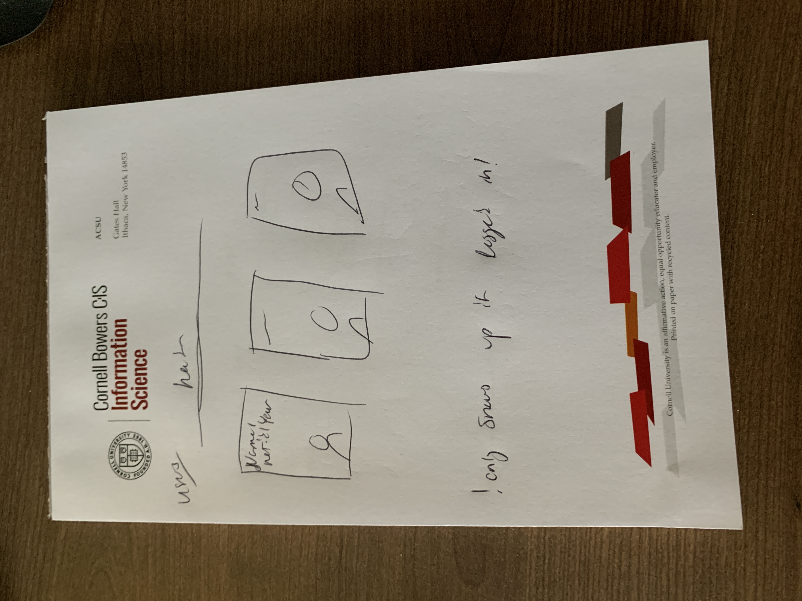

# Project 3: Design Journey

**For each milestone, complete only the sections that are labeled with that milestone.** Refine all sections before the final submission.

You are graded on your design process. If you later need to update your plan, **do not delete the original plan, rather leave it in place and append your new plan _below_ the original.** Then explain why you are changing your plan. Any time you update your plan, you're documenting your design process!

**Replace ALL _TODOs_ with your work.** (There should be no TODOs in the final submission.)

Be clear and concise in your writing. Bullets points are encouraged.

**Everything, including images, must be visible in _Markdown: Open Preview_.** If it's not visible in the Markdown preview, then we can't grade it. We also can't give you partial credit either. **Please make sure your design journey should is easy to read for the grader;** in Markdown preview the question _and_ answer should have a blank line between them.


## Design Plan (Milestone 1)

**Make the case for your decisions using concepts from class, as well as other design principles, theories, examples, and cases from outside of class (includes the design prerequisite for this course).**

You can use bullet points and lists, or full paragraphs, or a combo, whichever is appropriate. The writing should be solid draft quality.


### Catalog (Milestone 1)
> What will your catalog website be about? (1 sentence)

The catalog will be about Cornellians, similar to project 2, but with an expanded focus.

### _Consumer_ Audience (Milestone 1)
> Briefly explain your site's _consumer_ audience. Your audience should be specific, but not arbitrarily specific. (1 sentence)
> Justify why this audience is a **cohesive** group. (1-2 sentences)

The audience will be all Cornellians, but with a focus on the Cornellians who are interested in an exclusive social media platform to meet similar cornellians.

It is cohesive because it is specfically the Cornell student body.

### _Consumer_ Audience Goals (Milestone 1)
> Document your _consumer_ audience's goals for using this catalog website.
> List each goal below. There is no specific number of goals required for this, but you need enough to do the job (Hint: It's more than 1. But probably not more than 3.)
> **Hint:** Users will be able to view all entries in the catalog and insert new entries into the catalog. The audience's goals should probably relate to these activities.

Goal 1: View the database

- **Design Ideas and Choices** _How will you meet those goals in your design?_
  - The home page will recent posts by users
  - It will not require a login
- **Rationale & Additional Notes** _Justify your decisions; additional notes._
  - This allows visitors to see the site, and choose if they want to add themselves to the database

Goal 2: View the user database

- **Design Ideas and Choices** _How will you meet those goals in your design?_
  - The database can be seen by users that are logged in
  - They will be able to click on a user and see more info
  - And see the posts that they have made
- **Rationale & Additional Notes** _Justify your decisions; additional notes._
  - This allows them to find speficic people they are interested in learning more about.
  - It will help to connect them all together.

Goal 3: View details page about posts

- **Design Ideas and Choices** _How will you meet those goals in your design?_
  - The details page will show all the information about a posts, for users that are logged in.
  - They will be able to see its location, the time it was posted, tags, and comments.
- **Rationale & Additional Notes** _Justify your decisions; additional notes._
  - This allows consumers to learn more about a post and interact with others.

Goal 4: Add posts

- **Design Ideas and Choices** _How will you meet those goals in your design?_
  - Users will be able to add posts to the feed, if they are logged in
- **Rationale & Additional Notes** _Justify your decisions; additional notes._
  - This makes sense as social media platforms require users to be able to add posts
  - They will be able to add images, a descpription, and a location

### _Consumer_ Audience Device (Milestone 1)
> How will your _consumer_ audience access this website? From a narrow (phone) or wide (laptop) device?
> Justify your decision. (1 sentence)

The audience will use a wide device, such as a desktop, to access the site.

This is because anyone can have access to a desktop as a Cornell student, by going to the library. However, not everyone may use a smart phone.

### _Consumer_ Persona (Milestone 1)
> Use the goals you identified above to develop a persona of your site's _consumer_ audience.
> Your persona must have a name and a face. The face can be a photo of a face or a drawing, etc.

")

_Ezra Cornell (absolutely not a real person, absolutely no relation to our esteemed founder)_

**Factors that Influence Behavior:**

- Ezra Cornell, a woman, and having no relation to the founder of Cornell, is a Cornell student who is interested in meeting other Cornell students.
- Her parents named her Ezra, after their favorite school founder, Ezra Cornell.
- She resents her own name and often goes by "Ezy," which is a nickname she made up for herself.
- Ezra is now a freshman at Cornell.

**Goals:**

- Ezra is looking for a way to meet other Cornell students, as she is not a part of any clubs or organizations.
- She wants to stalk a hot guy she met a party last weekend, but she doesn't want to be creepy about it.
- She also wants to find a way to meet other Cornell students who are interested in music, as she is a musician herself.

**Obstacles:**

- Her parents are very strict, and she is not allowed to use social media.
- She is not allowed to use her laptop, as she is not allowed to have a laptop.
- Basically, her parents are her obstacle


**Desires:**

- What Ezra truly desires is love and acceptance from her parents.
- But if that's unattainable, then a social media platform that allows her to meet other Cornell students will do.

### _Administrator_ Audience (Milestone 1)
> Briefly explain your site's _administrator_ audience. Your audience should be specific, but not arbitrarily specific. (1 sentence)
> Justify why this audience is a **cohesive** group. (1-2 sentences)

The site will be administered by the Cornell IT department, and by Ming DeMers. ~~Also by Calvin Smith, because he asked.~~

This is cohesive as it makes sense that only IT individuals (and Ming ~~and Calvin~~) would be able to access the database, and mess around with the site. We wouldn't want just anyone (except Ming ~~and Calvin~~) to be able to access the database, and mess around with the site, now would we?

### _Administrator_ Audience Goals (Milestone 1)
> Document your _administrator_ audience's goals for using this catalog website.
> List each goal below. There is no specific number of goals required for this, but you need enough to do the job (Hint: It's more than 1. But probably not more than 3.)
> **Hint:** Users will be able to view all entries in the catalog and insert new entries into the catalog. The audience's goals should probably relate to these activities.

Goal 1: Delete the posts in the database

- **Design Ideas and Choices** _How will you meet those goals in your design?_
  - The database will be accessible to the IT department, and to Ming DeMers ~~, and to Calvin Smith~~
  - They will be able to add and delete posts
- **Rationale & Additional Notes** _Justify your decisions; additional notes._
  - This allows anyone to request an account, to be added to the database, and to be able to modify their own information

Goal 2: Add posts

- **Design Ideas and Choices** _How will you meet those goals in your design?_
  - Admins will be able to add posts, too
- **Rationale & Additional Notes** _Justify your decisions; additional notes._
  - They are users too! They are allowed to add posts as usual.

### _Administrator_ Persona (Milestone 1)
> Use the goals you identified above to develop a persona of your site's _administrator_ audience.
> Your persona must have a name and a face. The face can be a photo of a face or a drawing, etc.


Johnny John Johnston

**Factors that Influence Behavior:**

- Johnny is IT@Cornell, and a recent graduate at Harvard Law.
- Despite being in quite the debt for graduate school, he has chosen to follow his passion: IT
- He is a very passionate individual, and he is very passionate about IT.
- There is one problem, however: he is not very good at IT.
- Also, Johnny has a twin, Ynnohj, who tends to follow him around a lot, and only speaks in reverse.

**Goals:**

- Johnny wants to be a good IT person, by adding, modifying, and deleting entries
- He also wants to add images to the database
- And maybe get Ynnohj a job that isn't in Ithaca, so he can finally be left alone.


**Obstacles:**

- Crippling debt
- His twin
- His lack of IT skills

**Desires:**

- To be a good IT person
- To manage the database
- To be left alone


### Catalog Data (Milestone 1)
> Using your personas, identify the data you need to include in the catalog for your site's audiences.
> Justify why this data aligns with your persona's goals. (1 sentence)

posts db:

- netid
- file_name
- file_ext
- date
- location
- description

users db:

- Name
- NetID
- Year
- Major
- Clubs/Activities
- Other Interests
- bio
- password

comments db:

- netid
- post_id
- comment
- date

groups db:

- name

sessions db:

- user_id
- netid
- session
- last_login

tags db:

- post_id
- tag

user_groups db:

- netid
- group_id


The posts, users, comments, and tags db allows Ezra to find other users who have similar interests, and who are in the same year, and who are in the same major, and who are in the same clubs/activities, and who are in the same location. She can view other peoples posts, see their comments, how their tagged, and the location. If she is logged in, she can also add her own posts and interact with each other, as a social media platform.

On the other hand, Johnny, the admin, can easily manage the database, by choosing to delete posts, as well as everything else a base user can.

The general public can only view the home page, and the database, but they cannot interact with it, unless they are logged in. They can't post, see users, post details, etc.


### Site Design (Milestone 1)
> Design your catalog website to address the goals of your personas.
> Sketch your site's design:
>
> - These are **design** sketches, not _planning_ sketches.
> - Use text in the sketches to help us understand your design.
> - Where the content of the text is unimportant, you may use squiggly lines for text.
> - **Do not label HTML elements or annotate CSS classes.** This is not a planning sketch.
>
> Provide a brief explanation _underneath_ each sketch. (1 sentence)
> **Refer to your persona by name in each explanation.**


The home page of the site, it shows recent posts, and a search bar, and a login button. Ezra or Johnny can see the posts. However, Johnny can also edit or remove posts, if necessary.


Upon clicking a post, the Ezra or Johnny will be taken to the details page, where they can see the post in more detail. They can see who has liked it, and comments. If they aren't logged in, then they will be asked to login first.


Johnny or Ezra can view all the people in the database, and filter them by year, major, clubs/activities, and location. They can also search for people by name. Johnny can also add, modify, and delete people.


Upon clicking a person,  Ezra or Johnny will be taken to the details page, where they can see the person in more detail. Only users logged in can see the details.


if the Ezra or Johnny tries to access a page that doesn't exist, they will be taken to the 404 page, where they can be redirected to the home page.

## Some pages were changed, this is the new design
In general, each page has the same header and footer, which allow for easy navigation.


This new home page allows viewing of the posts database, and allows users to search for posts. A user can click on any post to view more information about it, or click a user to learn more about them.


Only some features are allowed for users that are logged in, so they are often prompted to login. This is the login page that shows up if a user is not logged in. They are also given the option to sign up (this feature does not work)


If a user that's logged in wants to see more about a post, they can. They can see the location, the date, the description, and the comments, and tags. They can click on a tag to see more posts with that tag, or a comment, to see the user.


If a user that's logged in wants to add a post, they can. They can add an image, a description, and a location. They can also add tags which are comma-seperated.


Logged in users can see their own profile, which is automatically detected who they are. They can see their own info, image, and their own posts.


Users that are logged in can see all the users in cornnect, and click on an individual to see more about them. They can see their bio, their image, and their posts.

### Catalog Design Patterns (Milestone 1)
> Explain how you used design patterns in your site's design. (1-2 sentences)

I used a multi-page design pattern, where the user can navigate between different pages. I also used a search bar, where the user can search for posts by tag. I also used a filter, where the user can filter posts tag, and order them. I also used a login button, where the user can login to the site. I also used a 404 page, where the user can be redirected to the home page, if they try to access a page that doesn't exist. A number of features are only available to users that are logged in, such as adding posts, and viewing other users.

## Implementation Plan (Milestone 1, Milestone 2, Milestone 3, Final Submission)

### Database Schema (Milestone 1)
> Plan the structure of your database. You may use words or a picture.
> A bulleted list is probably the simplest way to do this.
> Make sure you include constraints for each field.

Posts:

- id: INTEGER {PK, AI, NN, U},
- netid: STRING {NN}
- file_name: STRING {NN}
- file_ext: STRING {NN}
- date: DATE {NN I}
- location: STRING {}
- description: STRING {}

Comments:

- id: INTEGER {PK, AI, NN, U},
- netid: TEXT {NN} (refs users.netid),
- post_id: INTEGER {NN} (refs posts.id),
- comment: STRING {NN}

Groups:

- id: INTEGER {PK, AI, NN, U},
- name: STRING {NN}

Sessions:

- id: INTEGER {PK, AI, NN, U},
- user_id: INTEGER {NN} (refs users.id),
- netid: TEXT {NN},
- session: TEXT {NN},
- last_login: DATE {NN}

Tags:

- id: INTEGER {PK, AI, NN, U},
- post_id: INTEGER {NN} (refs posts.id),
- tag: TEXT {NN}

User_groups:

- id: INTEGER {PK, AI, NN, U},
- netid: TEXT {NN} (refs users.netid),
- group_id: INTEGER {NN} (refs groups.id)

Users:

- id: INTEGER {PK, AI, NN, U},
- name: STRING {NN},
- netid: TEXT {NN},
- year: INTEGER {NN},
- major: TEXT {NN},
- clubs: TEXT {},
- interests: TEXT {},
- bio: TEXT {},
- password: TEXT {NN} (hashed)


### Database Query Plan (Milestone 1, Milestone 2, Milestone 3, Final Submission)
> Plan _all_ of your database queries.
> You may use natural language, pseudocode, or SQL.

#### Home page query

- Allows for ordering of databast, filtering by tag.

```
$tag_param = $_GET['tag'] ?? NULL;
$select_clause = "SELECT * FROM posts";
$operator = '?';

if ($tag_param != NULL) {
  $select_clause = "SELECT *, posts.id AS id, tags.tag AS 'tag' FROM posts INNER JOIN tags ON (tags.post_id = posts.id) WHERE tags.tag = " . "'" . $tag_param . "'";
}

if ($_GET['order'] == 'old') {
  $order_clause = "ORDER BY date ASC";
} else {
  $order_clause = "ORDER BY date DESC";
}

$sql_query = $select_clause . " " . $order_clause . ';';

$posts = exec_sql_query(
  $db,
  $sql_query
)->fetchAll();
```

Post details:

- Only shows if logged in
- Also shows comments and tags

```

if (is_user_logged_in()) {
  $logged_in = true;
  $sql_select_post_query = "SELECT * FROM posts WHERE posts.id = " . $_GET['id'];
  $sql_select_tags_query = "SELECT posts.id AS id, tags.tag AS 'tag'
FROM posts INNER JOIN tags ON (tags.post_id = posts.id) WHERE posts.id = " . $_GET['id'];
  $sql_select_comments_query = "SELECT * FROM comments WHERE comments.post_id = " . $_GET['id'];

  $post = exec_sql_query(
    $db,
    $sql_select_post_query,
  )->fetchAll();

  $tags = exec_sql_query(
    $db,
    $sql_select_tags_query,
  )->fetchAll();

  $comments = exec_sql_query(
    $db,
    $sql_select_comments_query,
  )->fetchAll();
}
```

Users:

- Show all users, only if user is logged in

```
if (is_user_logged_in()) {
  $logged_in = true;
  if (isset($_GET['netid'])) {
    $users = exec_sql_query(
      $db,
      "SELECT * FROM users WHERE users.id = " . $_GET['netid'] . ";"
    )->fetchAll();
  } else {
    $users = exec_sql_query(
      $db,
      "SELECT * FROM users;"
    )->fetchAll();
  }
}
```

User detail:

- Show user details, only if user is logged in

```
if (is_user_logged_in()) {
  $logged_in = true;
  $user = exec_sql_query(
    $db,
    "SELECT * FROM users WHERE users.netid = " . "'" . $_GET['netid'] . "'" . ";"
  )->fetchAll();

  $posts = exec_sql_query(
    $db,
    "SELECT * FROM posts WHERE posts.netid = " . "'" . $_GET['netid'] . "'" . ";"
  )->fetchAll();
}
```

Sidebar query:

- Show all tags for filtering in the sidebar of the homepage

```
$tags = exec_sql_query(
  $db,
  "SELECT * FROM tags"
)->fetchAll();
```

### User details
## Complete & Polished Website (Final Submission)

### Accessibility Audit (Final Submission)
> Tell us what issues you discovered during your accessibility audit.
> What do you do to improve the accessibility of your site?

- There were a number of form label issues that were fixed.
- Some contrast issues were fixed by changing the colors or form inputs


### Self-Reflection (Final Submission)
> Reflect on what you learned during this assignment. How have you improved from Projects 1 and 2?

I learned a lot on how to mnaiuplate and display databases. Moreover, how to get databases to work together to show many different types of information. I also learned how to use PHP to make a website more dynamic, and how to use PHP to make a website more secure. I learned about user controls and how to allow for adding and removing from a database.

My projects have improved as project 3 is a much more encompassing and whole experience. While there are some features I hope to add (user sign up, liking posts, commenting on posts, and editing posts), I am very happy with the progress I have made. I am also very happy with the design of the website, and how it looks. I think it is very clean and easy to use. The color scheme is not serious, but I've chosen to stick with it.

> Take some time here to reflect on how much you've learned since you started this class. It's often easy to ignore our own progress. Take a moment and think about your accomplishments in this class. Hopefully you'll recognize that you've accomplished a lot and that you should be very proud of those accomplishments! (1-3 sentences)

I am proud of the website I've created and the progress I've made. I am proud of the design of the website, and how it looks. I think its cool that I made a database, and how it works. I am proud of the PHP, how it works with partials, and how all the pages query in different ways. I worked on the security of the website, as well as ensuring accessibility. This class has helped me to make modern web pages that we see everyday.


### Collaborators (Final Submission)
> List any persons you collaborated with on this project.

None.


### Reference Resources (Final Submission)
> Please cite any external resources you referenced in the creation of your project.
> (i.e. W3Schools, StackOverflow, Mozilla, etc.)

W3Schools, PHP documentation, Mozailla Reference.


### Grading: User Accounts (Final Submission)
> The graders will need to log in to your website.
> Please provide the usernames and passwords.

**Administrator User:**

- Username: jjj45
- Password: monkey

**Consumer User:**

- Username: mtd64
- Password: monkey

**Note:** Not all websites will support consumer log in. If your website doesn't, say so.


### Grading: Step-by-Step Instructions (Final Submission)
> Write step-by-step instructions for the graders.
> The project if very hard to grade if we don't understand how your site works.
> For example, you must log in before you can delete.
> For each set of instructions, assume the grader is starting from /

_View all entries:_

1. All entries are shown on the home page. There is nothing else required. Simply scroll.

_View all entries for a tag:_

1. On the sidebar, click on a tag. Most tags only have one post.
2. "Libe Slope" (towards the bottom) has three posts.
3. You may also search by tag, in the search bar.

_View a single entry's details:_

1. Click on any post, either the image or "more details"
2. You must be logged in. You will be prompted to login if you are not.
3. Post details can be done anywhere a post is shown. For example, the posts in a user's profile.

_How to insert and upload a new entry:_

1. Click on "Add Post" in the navigation bar
2. If not logged in, sign in either as a consumer or admin
3. Fill out the form, and click submit
4. Only jpgs under 1mb are allowed. Location is requried, description and tags are optional.

_How to delete an entry:_

1. Login as an admin. "ADMIN MODE ENABLED" will display in the navbar
2. Click on the post you want to delete
3. A button that says "delete post permanantly" will appear
4. It will confirm that you deleted a post.
